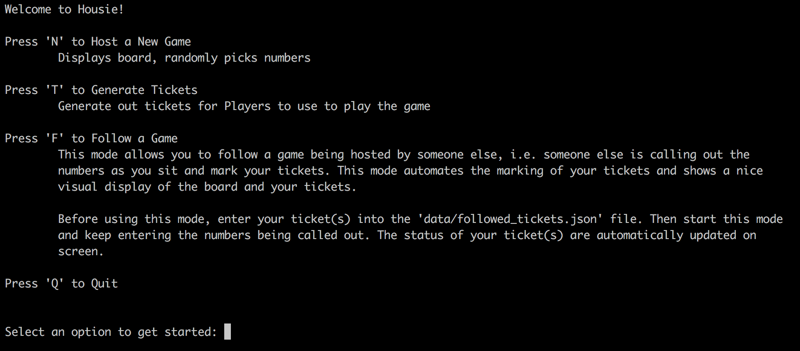
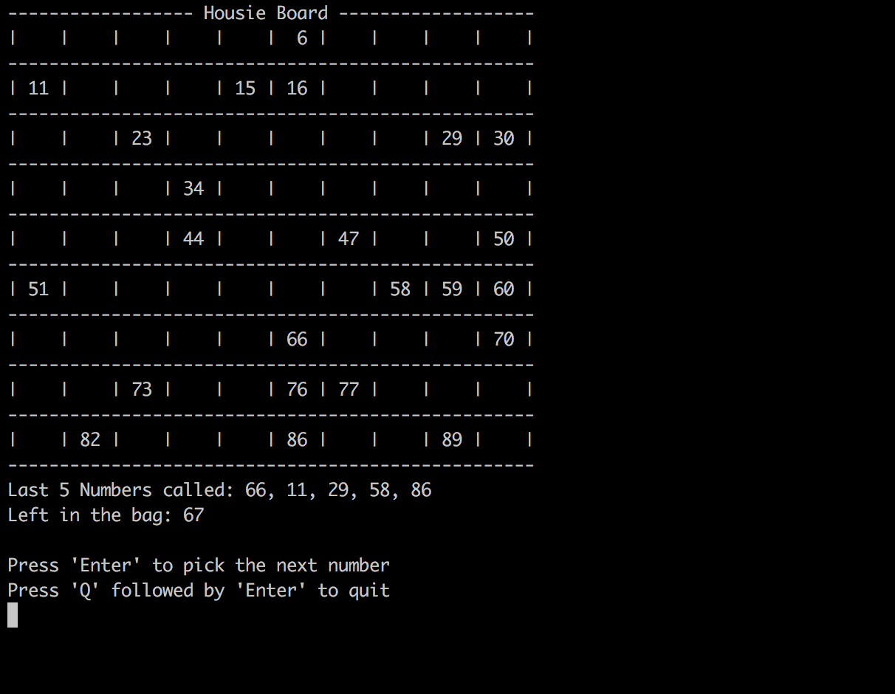
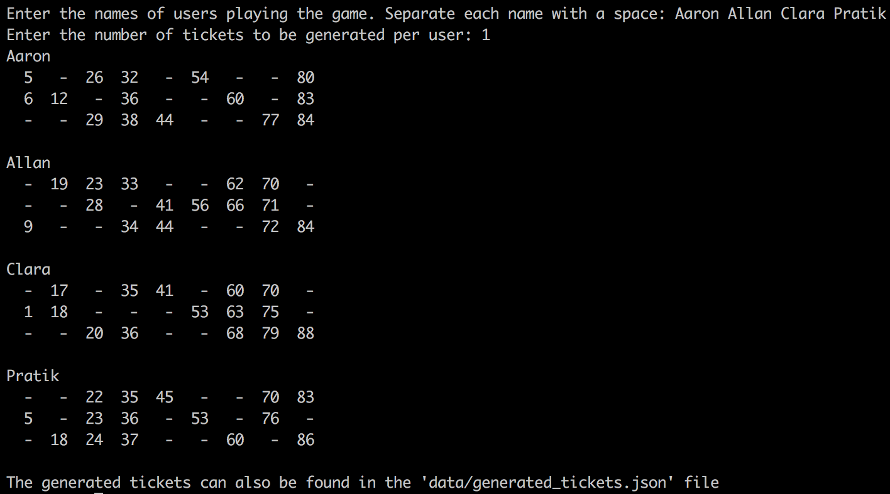
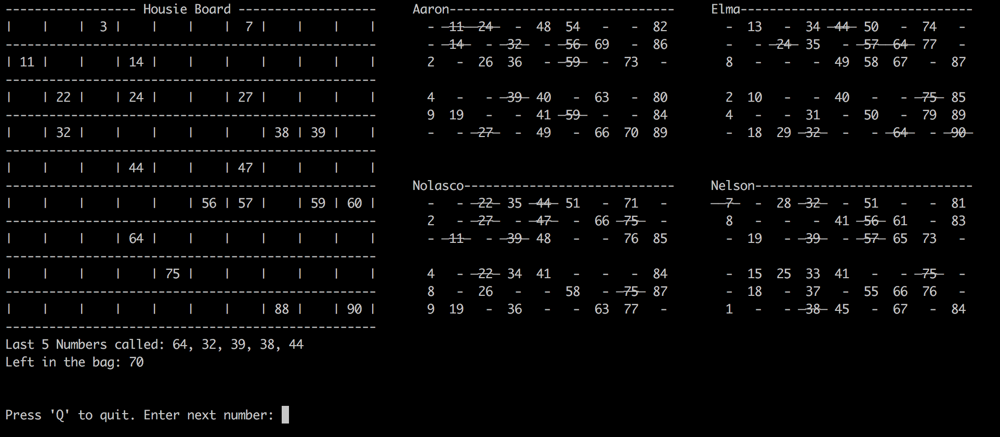

# Housie
Provides all the core models and logic required to simulate and play the classic game 'Housie' (also known as 'Bingo' or 'Tambola'). 

All the code is well segregated, so should be a breeze if you want to
reuse and build upon any of the components.
 
Also provided is a simple terminal-driven menu that let's you generate tickets and play the game, 
if that's all you want to do.


## Core Features Provided:

* Generating Housie Tickets to play the game (Ticket format is accurate! Numbers are exactly where they are supposed to be).
* Maintaining state of the Housie board and displaying the board visually in terminal.
* Randomly picking numbers on the board, for when you're hosting a game with friends.
* Auto-marking the numbers on your tickets, for when you are following a game hosted by someone else.


## Installation and Setup

* Make sure you have python 3 installed. (If not you can get it here -> https://www.python.org/downloads/)  
* Then install housie using pip:
```bash
pip install --upgrade housie
```

## Usage (Game-play)

If you are just looking to play the game, it's pretty simple. Just open terminal and run the following command.

```bash
python -m housie.game
```
This will start up the game and show you the main menu. 


You have a few options here like: Host a game, Generate tickets, Follow a game.
Each of these is explained in the following section.


## Game-play Features 
This section explains each of the features present in the main menu of the game.

### Host a New Game 
* This mode displays the housie board on the screen and lets you randomly pick numbers.
* This mode is for when you are playing a game with friends. 
* The board is constantly updated with the selected numbers. 
* Before using this mode, you may want to generate 
and distribute tickets among your friends. 




### Generate Tickets
* As the name suggests, this mode allows you to generate tickets. 
* You specify the names of players and the number of tickets per player, and the program generates and prints 
out the tickets on the screen.
* The generated tickets are also stored in `data/generated_tickets.json` in the current directory from 
which you ran the game.



### Follow a Game
* This mode was built as a convenience mode for when playing games that are hosted by someone else. 
It auto-marks your tickets as you enter the numbers called out. (NOTE: It's not as fun to play housie this way xD but 
it is helpful if you're playing with multiple tickets)
* Before starting this mode, you need to create a json file representing the tickets you want to use for the game. 
You must name your file `followed_tickets.json`. Use the [sample file](data/followed_tickets.example.json) as a 
reference. Create a folder named `data` in the current directory from where you intend to run the game and place your 
file into that folder. These steps are important because
the program expects to find the `followed_tickets.json` file inside a `data` folder in the current directory.
 
* Then start up this mode. You will see the housie board displayed along with your tickets.
* Enter the numbers called out by the host and these numbers will be automatically crossed out in your tickets.
* **Note**: This mode persists game state (i.e. even if you shut the program suddenly and start up again, you can 
continue where you left off). If you want to start a new followed game, just delete the `data/followed_board.json` file.




## Using the Underlying models and modules
This section will provide some details on accessing and manipulating the underlying models and modules in 
order to use them in your own projects. 

**There are only two core models involved:**
* Board
* Ticket

## Board
This model is for representing and manipulating the state of the housie board. It stores which numbers have been called 
out, and which are left in the pool. It provides methods to randomly or manually pick numbers from the remaining pool, 
list the last 5 numbers that were picked, and also exposes a convenience method to display the board visually in the 
terminal.

It can be imported as shown below:
```bash
from housie import Board
```
You can then create and use it as follows:
```bash
board = Board()  # Initialize an empty board
board.pick_next()   # Picks and returns a number at random and updates the state of the board
board.display_board()   # Display the board visually in the terminal
board.last_5_selected()   # Returns a list of the last 5 numbers that were selected
```
You can also initialize the board with some numbers already called out:
```bash
board = Board([1,22,34,55,64,32])  # Initialize board with some numbers called out
```
You can also manually select numbers on the board
```bash
board.pick_manual(5)   # Adds 5 to the pool of selected numbers
```

## Ticket
This model is for representing and manipulating the state of a housie ticket. Stores the 15 numbers that make up 
the ticket, along with those numbers which have been marked/crossed out. Provides methods to mark numbers and 
to display the ticket visually in the terminal.

It can be imported from `housie.models` as shown below:
```bash
from housie.models import Ticket
```
You can create a Ticket in a couple of ways:

`1.` Manually by passing in the 15 numbers row-wise to the Ticket constructor. (Although this is not recommended, as 
there are very specific rules for selecting and placing the numbers in each of the rows/columns) 
```bash
ticket = Ticket([[11, 24, 48, 54, 82], [14, 32, 56, 69, 86], [2, 26, 36, 59, 73]])
```
`2`. You could rather use the **generate_ticket()** function to create your tickets. This function adheres
to all the rules for generating tickets and creates a completely random ticket for you each time you call it.
```bash
from housie import generate_ticket
ticket = generate_ticket()
```
`3.` You could also use the **load_tickets()** function to load your tickets from a json file (provided they are in the 
correct format. For a sample file, refer [here](data/followed_tickets.example.json)). This function returns a 
dictionary in which the key is the name of the user and the value is the list of tickets belonging to that user.
```bash
from housie import load_tickets
ticket_data = load_tickets('ticket_data.json')
for name, tickets in ticket_data.items():
    print(name)
    for ticket in tickets:
        print(ticket.display_ticket)
```

You can cross out numbers in your tickets:
```bash
ticket.mark_number(number_to_mark)
```

And display your ticket:
```bash
ticket.display_ticket()
```


## Extending and Adding new functionality
The purpose of this package is to provide the core models and logic required to play/simulate the game. 
Keeping this in mind, I have tried to segregate the code as per functionality and reusability. 

Feel free to add upon this base layer.
##

**Author**

```

  Aaron Alphonso (https://github.com/aaronalphonso)
  Email: alphonsoaaron19@gmail.com
  
``` 
